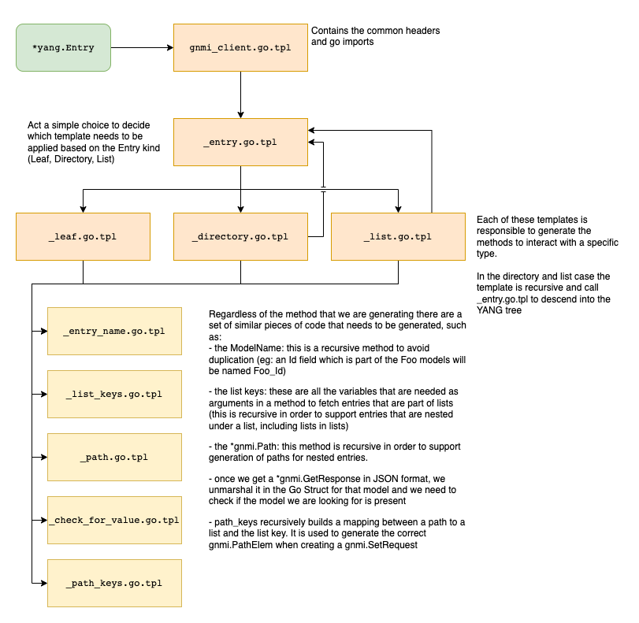

# gNMI Client Generator

This package is responsible of generating a `gNMI` client starting from a `YGOT` generated `Schema`.

## Overview

The generation of the `gNMI` client for a given model takes place in two steps:
- The `model-compiler` Docker image (see the main [README](../../README.md) for more information) generates the basic structure for
an `onos-config` model plugin, which includes:
  - the `YGOT Schema`, eg: [generated.go](../../models/testdevice-1.0.x/api/generated.go)
  - the `gNMI generator`, eg: [gnmi-gen.go](../../models/testdevice-1.0.x/gnmi-gen/gnmi-gen.go)
- The `gNMI generator` is invoked and simply passes the `YGOT Schema` to the main [generator](./generator.go)
  - _NOTE that we need the intermediate step as the `YGOT schema` is generated in the model-plugin generation step and can't be dynamically imported into the main generator_

### The generator

The `generator` relies on a set of [templates](template/) that are organized following this structure:

In addition to the above-mentioned templates the `generator` relies on a set of helper functions (defined as part of `template.FuncMap`)
which are made available to the template to facilitate the parsing of a `yang.Entry`.

The generated code relies on a few commodity methods defined in [`gnmi_utils`](./gnmi_utils/utils.go)
which are used to encode and decode `gNMI` requests.